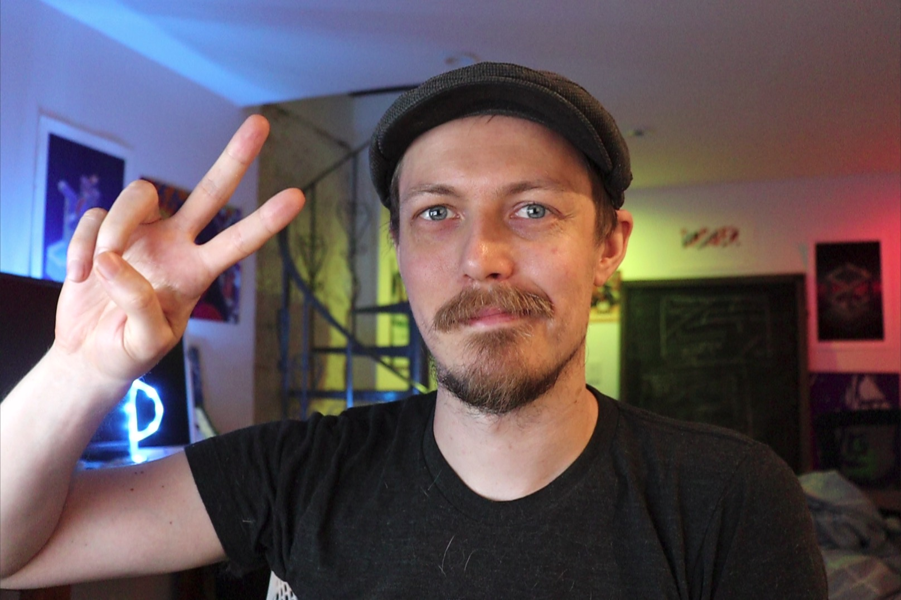
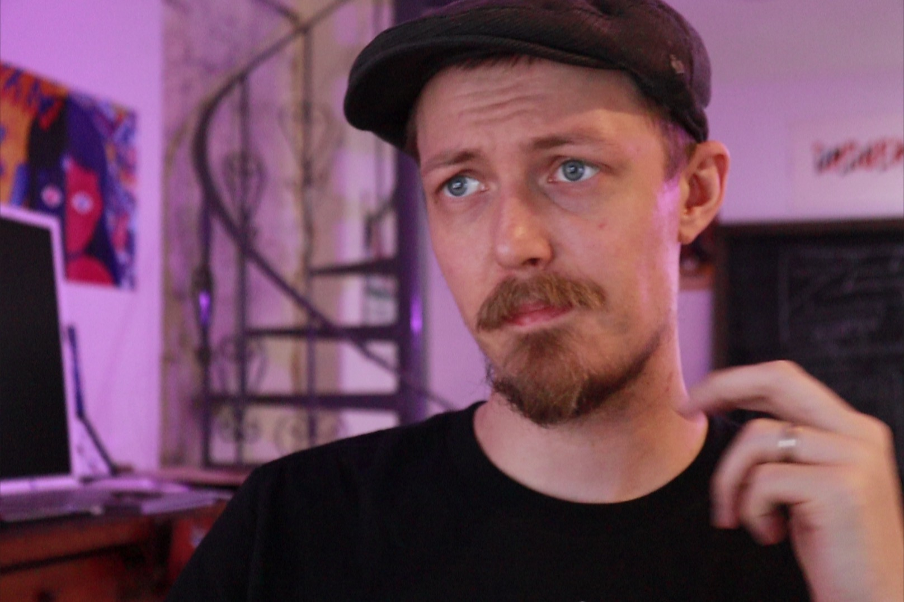

## Orta Therox Speaker's Bio

### Bios

There are a few options depending on your target audience:

General Tech / OSS scale focused

> Orta is a developer/designer who works on the TypeScript compiler team at Microsoft. He's worked on very large scale open source projects across the Ruby, iOS and Node ecosystems for the last decade, ranging from CocoaPods to Danger. He's an active Open Source contributor that GitHub follows him on twitter.

iOS Eco-system Focused

> Orta is a developer/designer who works on the TypeScript compiler team at Microsoft after a decade or so building native macOS and iOS apps. You've likely used his work on CocoaPods, and hopefully you're in a team using Danger. He's contributed to almost every major iOS OSS infrastructure project in the pre-Swift days and has been focusing on JavaScript for the last few years.

JS Eco-system Focused

> Orta is an Engineer on the TypeScript team in Microsoft. He has a decade of open source contributions ranging across many eco-systems, helps maintain a dependency manager for iOS, built Danger in many languages, contributes to working groups like GraphQL and in core teams like Jest, Svelte and React Native. You've probably seen his open source design work, and is currently working on improving documentation for TypeScript.

### Pics

